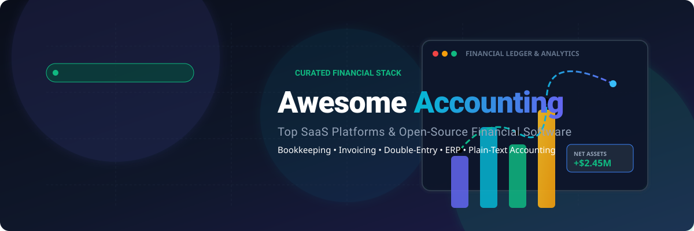

# 💼 Awesome Accounting 📊

  <strong>A curated list of delightfully awesome accounting software, bookkeeping tools, double-entry ERPs, invoicing platforms, and financial reporting solutions.</strong>

  
  
  
  
  
  

---

*Focused on Bookkeeping, Invoicing, Financial Reporting, Multi-Currency, Payroll Integration, Double-Entry Systems & Small-to-Midsize Business Accounting*  
**📅 Last updated: August 2026**

## 📑 Table of Contents
- [🔍 Overview & SEO Highlights](#-overview--seo-highlights)
- [🏢 SaaS & Hosted Platforms](#-saas--hosted-platforms)
- [💻 Open-Source GitHub Projects](#-open-source-github-projects)
- [🧩 Frameworks & Plain-Text Accounting](#-frameworks--plain-text-accounting)
- [❓ Frequently Asked Questions (FAQ)](#-frequently-asked-questions-faq)
- [📈 Star History](#-star-history)
- [🤝 How to Contribute](#-how-to-contribute)
- [⚖️ Disclaimer](#-disclaimer)

---

## 🔍 Overview & SEO Highlights

This repository tracks premier **SaaS platforms** and **open-source accounting solutions** covering:
- **📒 General Ledger & Chart of Accounts**: Full double-entry bookkeeping with strict audit trails.
- **🧾 Invoicing & Accounts Receivable (AR)**: Recurring invoices, estimates, online payment gateways, and automated payment reminders.
- **💳 Accounts Payable (AP) & Expense Tracking**: Receipt OCR capture, vendor bills, and mileage tracking.
- **🏦 Bank Feeds & Automated Reconciliation**: Live bank statement sync, rule engines, and smart transaction matching.
- **📊 Financial Statements & Tax Compliance**: Balance sheets, profit & loss (P&L), cash flow statements, VAT/GST reporting, and Making Tax Digital (MTD) readiness.

---

## 🏢 SaaS & Hosted Platforms

> Sorted in descending order by **Company Scale (Market Capitalization / Valuation / Revenue)**.

| 🏢 Platform | 📝 Description | 🏛️ Company Scale (Market Cap / Valuation / Revenue) | 🏷️ Starting Pricing | 🎁 Free Tier / Trial Limits |
| :--- | :--- | :--- | :--- | :--- |
| **[Oracle NetSuite](https://www.netsuite.com/)** | Full cloud ERP with enterprise-grade accounting modules for mid-market and enterprise organizations requiring multi-subsidiary consolidation and complex financial operations. | **~$422 Billion** (Parent Oracle Market Cap; ~$57.4B FY2025 Revenue) | Starts at **~$999/mo** base platform fee + **~$99/user/mo** (typically $25,000–$30,000+/yr minimum deployment) | **14-day guided sandbox / demo environment** access via authorized partner or sales representative (no permanent free tier). |
| **[QuickBooks Online](https://quickbooks.intuit.com/)** | The most widely adopted cloud bookkeeping and tax preparation platform for small and midsize businesses in the US, with deep accountant workflows and extensive integration ecosystem. | **~$101 Billion** (Parent Intuit Market Cap; ~$18.8B FY2025 Revenue) | Starts at **$38/mo** (Simple Start tier; Solopreneur plan starts at $20/mo; frequent 50% intro discounts) | **30-day free trial** with full access to paid features (credit card required after trial) or **QuickBooks Free** plan (limited to 1 bank account and basic monthly invoicing). |
| **[Sage Intacct](https://www.sage.com/en-us/sage-intacct/)** | AICPA-preferred cloud financial management software tailored for growing businesses needing multi-entity management, strong internal controls, and deep GAAP compliance. | **~$13 Billion / £9.7B** (Parent Sage Group Market Cap; ~£2.51B Revenue) | Starts at **~$15,000/yr** (~$1,250/mo base platform; user licenses typically $200–$400/user/mo) | **30-day interactive demo / sandbox test drive** available upon sales consultation (no permanent free tier). |
| **[Xero](https://www.xero.com/)** | Clean, modern cloud accounting software popular globally for unlimited users across all tiers, robust bank reconciliation, and rich multi-currency handling. | **~$12.9 Billion NZD** (Public ASX: XRO; ~$2.3B NZD Revenue) | Starts at **$25/mo** (Early tier; $55/mo for Growing, $90/mo for Established) | **30-day free trial** (no credit card required; full feature access; Early plan capped at 20 invoices/quotes & 5 bills/mo; no permanent free tier). |
| **[Zoho Books](https://www.zoho.com/books/)** | Feature-complete, affordable accounting suite that seamlessly connects with the broader Zoho ecosystem (CRM, Inventory, Expense, and Payroll). | **~$8 Billion+** (Private Zoho Corp Valuation; ~$1.5B+ Annual Revenue) | **$0/mo** (Free plan); Standard paid plan starts at **$15/mo** (billed annually) or $20/mo (billed monthly) | **Free forever** for businesses with annual revenue under $50K USD / ₹25L (1 user + 1 accountant, up to 1,000 invoices/yr); **14-day free trial** for paid plans. |
| **[FreshBooks](https://www.freshbooks.com/)** | Invoicing-first small business accounting software with integrated time tracking, project billing, client portals, and payment acceptance. | **~$1.2 Billion+** (Private Unicorn Valuation; ~$100M–$500M Est. Revenue) | Starts at **$21/mo** (Lite tier; introductory promotions frequently start at $6.30–$10.50/mo for first 3–6 months) | **30-day free trial** (no credit card required; full feature access; Lite plan limited to 5 billable clients; no permanent free tier). |
| **[Wave](https://www.waveapps.com/)** | Straightforward bookkeeping and invoicing tool tailored for micro-businesses, sole proprietors, and freelancers. | **~$405 Million** (Acquired by H&R Block; ~$13M–$50M Est. Revenue) | **$0/mo** (Starter plan); Pro plan starts at **$19/mo** (or $190/yr) | **Free forever** (Starter plan includes unlimited invoicing, estimates, and manual bookkeeping for up to 2 collaborators; excludes automated bank feeds and OCR scanning). |
| **[FreeAgent](https://www.freeagent.com/)** | UK-tailored cloud accounting software specialized for contractors, freelancers, and small limited companies with built-in tax forecasts and MTD filing. | **~$70 Million+** (Acquired by NatWest Group; ~$40M Annual Revenue) | Starts at **$27/mo** (frequently 50% off for first 6 months; free for NatWest/RBS/Ulster/Mettle business banking accounts) | **30-day free trial** (no credit card required; invoice emailing restricted to 2 addresses during trial; free indefinitely when connected to eligible bank account). |
| **[Kashoo](https://www.kashoo.com/)** | Streamlined bookkeeping and smart transaction categorization designed for simplicity and stress-free small business accounting. | **Bootstrapped / Micro-SaaS** (~$5M–$10M Est. Annual Revenue) | Starts at **$20–$27/mo** (TrulySmall Accounting) or **$30/mo** ($324/yr for full Kashoo) | **14-day free trial** (no credit card or upfront commitment required; full access to income/expense tracking and invoicing; no permanent free tier). |
| **[ZipBooks](https://zipbooks.com/)** | Fast, intuitive bookkeeping and invoicing app featuring smart feedback scores, time tracking, and simple financial reports. | **Bootstrapped / Seed** (~$2M–$5M Est. Annual Revenue) | **$0/mo** (Starter plan); Smarter paid plan starts at **$15/mo** ($35/mo for Sophisticated) | **Free forever** (Starter plan includes 1 user, 1 connected bank account, unlimited invoices/customers/vendors, and basic reporting; excludes recurring billing). |

---

## 💻 Open-Source GitHub Projects

> Ranked and sorted in descending order by **GitHub Star Count** 🌟. Click any star badge to view stargazers.

- **[Maybe](https://github.com/maybe-finance/maybe)**   
  *The modern open-source personal and business finance application built with Ruby on Rails, designed as a self-hostable alternative to proprietary wealth management and ledger tools.*

- **[Odoo Community](https://github.com/odoo/odoo)**   
  *Massive, modular open-source ERP framework with a mature double-entry accounting engine covering invoicing, payments, asset depreciation, bank synchronization, and local tax localization packages.*

- **[ERPNext (Frappe)](https://github.com/frappe/erpnext)**   
  *Complete, production-ready open-source ERP for businesses worldwide featuring a general ledger, multi-currency accounts, automated reconciliation, dimension-based financial reports, and tax templates.*

- **[Actual Budget](https://github.com/actualbudget/actual)**   
  *A super-fast, 100% local-first personal finance and envelope budgeting system with end-to-end encryption, multi-device synchronization, and automated bank sync capabilities.*

- **[Firefly III](https://github.com/firefly-iii/firefly-iii)**   
  *A self-hosted personal finance manager featuring strict double-entry bookkeeping, rule-based transaction pipelines, recurring transaction automation, multi-currency support, and extensive REST APIs.*

- **[Akaunting](https://github.com/akaunting/akaunting)**   
  *Web-based, full-featured accounting software specifically designed for small businesses and freelancers, providing invoicing, bill management, expense tracking, client portals, and modular app extensions.*

- **[Invoice Ninja](https://github.com/invoiceninja/invoiceninja)**   
  *Leading open-source and self-hostable invoicing, expense tracking, and time-billing platform supporting over 40+ payment gateways, client sidebars, auto-billing, and customizable PDF templates.*

- **[Crater](https://github.com/crater-invoice-inc/crater)**   
  *A modern open-source invoicing and billing solution for freelancers and small businesses with Vue.js web UI and mobile companion apps.*

- **[Ledger](https://github.com/ledger/ledger)**   
  *The original command-line double-entry accounting software written in C++ that inspired the entire Plain-Text Accounting (PTA) ecosystem.*

- **[Beancount](https://github.com/beancount/beancount)**   
  *A computer language that defines financial transactions in text files, parses them into memory, and generates financial balance sheets and income reports (often paired with the beautiful Fava web UI).*

- **[Kill Bill](https://github.com/killbill/killbill)**   
  *Open-source subscription billing and payments platform designed for scale, enabling complex catalog billing, invoice generation, and revenue lifecycle tracking.*

- **[Frappe Books](https://github.com/frappe/books)**   
  *Free, lightweight, offline-first desktop bookkeeping and invoicing software powered by SQLite and Electron, crafted for freelancers and small business owners.*

- **[hledger](https://github.com/simonmichael/hledger)**   
  *Fast, reliable plain-text accounting toolset implemented in Haskell offering CLI, terminal UI (TUI), and web-based UI for strict double-entry tracking.*

- **[GnuCash](https://github.com/Gnucash/gnucash)**   
  *Battle-tested, multi-platform desktop double-entry accounting software equipped with checkbook-style register, scheduled transactions, financial statement graphing, and QIF/OFX/HBCI bank import.*

- **[Bigcapital](https://github.com/bigcapitalhq/bigcapital)**   
  *Modern open-source accounting and inventory platform built on Node.js/React that provides double-entry bookkeeping, smart analytics, and team collaboration.*

- **[InvoicePlane](https://github.com/InvoicePlane/InvoicePlane)**   
  *Self-hosted open-source web application for managing quotes, invoices, clients, and payment tracking for sole traders and small service businesses.*
- **[Toolkit Labs Invoice](https://github.com/YtinuMoc/toolkitlabs-invoice)**   
  *Browser-based invoice and receipt generator — fill seller, buyer, and line items, then print or save as PDF locally with no account. [Commercial white-label pack (EUR 249 one-time)](https://buy.stripe.com/bJeeVea187TScZwb095Ne0k?client_reference_id=awesome-accounting-v1) adds your logo, colors, six templates, unlimited batch CLI, no third-party footer. [Live demo](https://ytinumoc.github.io/toolkitlabs-invoice/).*

- **[Money Manager Ex](https://github.com/moneymanagerex/moneymanagerex)**   
  *Free, open-source, cross-platform personal finance software featuring cash flow forecasting, asset tracking, stock investment tracking, and SQLite storage.*

- **[LedgerSMB](https://github.com/ledgersmb/LedgerSMB)**   
  *PostgreSQL-backed double-entry accounting and ERP web system delivering inventory management, order tracking, quotation generation, and multi-currency financials.*

---

## 🧩 Frameworks & Plain-Text Accounting

For custom setups and specialized accounting workflows:
- **Enterprise & Complete Business Management**: Deploy **ERPNext** or **Odoo Community** for comprehensive multi-subsidiary ledgers, supply chain, and payroll.
- **Micro-Business & Invoicing-First**: Use **Akaunting**, **Invoice Ninja**, or **Frappe Books**.
- **Local-First & Personal Budgeting**: Choose **Actual Budget**, **Firefly III**, or **Maybe**.
- **Plain-Text Accounting (PTA)**: Combine **Beancount (with Fava)**, **hledger**, or **Ledger** with Git version control for transparent, immutable audit trails.

---

## ❓ Frequently Asked Questions (FAQ)

<strong>What is double-entry accounting and why is it essential?</strong>

Double-entry accounting requires that every financial transaction is recorded with at least two equal and offsetting entries (a debit to one account and a credit to another). The fundamental accounting equation is: <code>Assets = Liabilities + Equity</code>. This prevents balance errors, maintains mathematical consistency, and produces accurate balance sheets and income statements.

<strong>When should I choose open-source accounting software over SaaS?</strong>

Choose open-source if you need complete data ownership, on-premise privacy, customization of tax/invoicing logic, or immunity to SaaS price hikes. SaaS is preferable if you require out-of-the-box live bank feeds, turnkey accountant collaboration, and automated multi-jurisdictional tax filings without hosting maintenance.

<strong>What is Plain-Text Accounting (PTA)?</strong>

Plain-Text Accounting stores all transactions in human-readable plain text files (e.g., <code>.ledger</code> or <code>.beancount</code>). It enables developers and power users to track personal and company finances using Git, command-line scripts, diffs, and lightweight web UIs like Fava.

---

## 📈 Star History

---

## 🤝 How to Contribute

1. 🍴 Fork this repository.
2. 📝 Add or update entries in `README.md` adhering to the table or list schema.
3. 🔗 Ensure all links are active and provide neutral, factual summaries with star badges where applicable.
4. 🚀 Submit a Pull Request (PR) with a clear title and description.

⭐ **Star this repository** if you find it helpful for navigating the accounting ecosystem!

---

## ⚖️ Disclaimer

- This is a **community-curated** educational directory — not an endorsement or formal financial advice.
- Financial systems handle critical records. Businesses and individuals remain responsible for tax compliance, statutory audits, data backup security, and regulatory mandates in their jurisdiction.
- For self-hosted solutions, ensure robust backup routines, database encryption, and regular security patching.

---

  Built with ❤️ for entrepreneurs, bookkeepers, accountants, developers, and finance leaders seeking transparent, controllable accounting tools.

